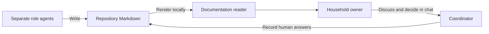

# WealthMesh: household financial health

This project is for one household, on this computer through localhost, without login. Project setup and [FIN-001 household and first checking](features/household-checking/index.md#next-stage) are accepted. FIN-001 delivers household/member correction, individual/joint checking, saved exact balances and a modern responsive workspace; activity and other financial features remain deferred.

## Current work and your review

Open the [FIN-001 combined packet](features/household-checking/index.md#next-stage) for current accepted status and its retained design, independent results, demo and operating guidance under D-032/D-036. The [canonical setup status](features/setup/status.md) retains acceptance under D-026. No next feature is assigned; wider release scope remains open in Q-004. Approval and acceptance are distinct actual human decisions.

- [Questions awaiting or retaining your answers](questions.md)
- [Human decisions and their history](decisions.md)
- [Feature index](features/index.md)
- [Requirements captured for future scope selection](requirements/index.md)
- [Process comparison and ten-minute assignment guidance](process-improvement.md)

## Understand what agents build

Read the [annotated screens](features/setup/ux-design.md), [architecture](features/setup/architecture.md) and [acceptance test plan](features/setup/acceptance-test-plan.md) together. [Agent responsibilities](agent-roles.md) and [bounded tasks and handoffs](features/setup/agent-protocol.md) explain who produces and independently checks each result.

This diagram shows the communication path. Agents write repository Markdown; the local reader displays it. You use chat for questions and decisions, and the coordinator records consequential answers in the separate registers. No approval button, document editor or agent execution control is part of this reader.

The source section below the diagram retains the original text and canonical Markdown path. Diagram failure keeps that source and ordinary article text available.

## Find explanations and evidence

The developer handoffs explain the work at three boundaries: [Java backend](features/setup/backend-implementation.md), [platform and frontend](features/setup/platform-implementation.md), and [documentation reader and requirements snapshot](features/setup/docs-implementation.md). Their results are developer evidence. Independent validation and review are separately recorded before a working demo is presented for human acceptance.

Open the [plain-English implementation explanation](features/setup/implementation.md), [working demo](features/setup/demo.md) and [operating guide](operations/index.md) for the integrated delivery. Missing outputs must remain identified as unavailable in their role records; a proposed command is not a passing test.

## Use the reader

Use **Search documentation** to search local page titles and content. The sidebar leads to the current feature, questions, decisions, roles and engineering reference. Saved Markdown refreshes during the development server session; diagrams render locally and search uses no external service. The reader can run while Java and PostgreSQL are stopped.

Each page shows its canonical Markdown source path at the end. Code references outside documentation are labelled **Local source path**, with a line reference where supplied. Select and copy these paths into your editor; browser navigation follows rendered Markdown pages. The reader does not serve arbitrary disk files.

For maintenance expectations, read [coding standards](coding-standards.md) and [delivery workflow](workflow.md). For lifecycle commands and technical troubleshooting, read the [operating guide](operations/index.md).
